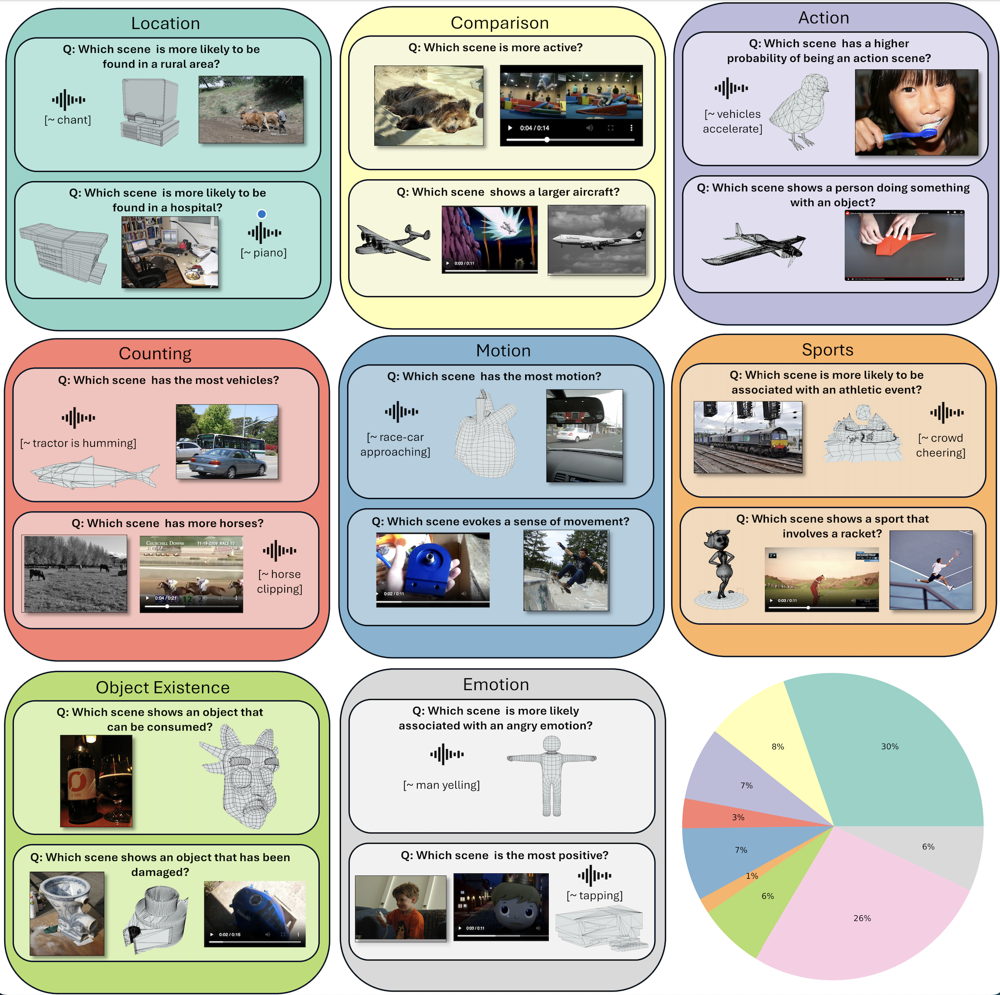

# DisCRn Benchmark: Evaluating Discriminatory Cross-Modal Reasoning in Audio, Video, Image, and 3D
[🍎 <a href=https://artemisp.github.io/discrn-dataset/>Project Page</a>] [📖 <a href=https://artemisp.github.io/discrn-dataset/> arXiv Paper</a>] [[📊 <a href=data/discrn_balanced.json >Dataset</a>]

## Overview


## Data
We store the data in an easy to use `json` format. The final filtered dataset can be found in `data/discrn_balanced.json` and it follows the following format:
```
{
    "id": "r7",
    "selection_type": "random",
    "q_type": "mc_2",
    "examples": [
        {
            "source": "clothov1_instruct_val",
            "id": "street 2.wav",
            "caption": "A busy street with a car shifting gears in traffic"
            "url": "" # only if available
        },
        {
            "source": "objaverse_pointllm_val",
            "id": "760c0d78327b4846975061c6cd8fd004",
            "caption": "a red sports car with black wheels."
            "url": "" # only if available
        }
    ],
    "modalities": [
        "audio",
        "pc"
    ],
    "questions": [
        "Which scene  evokes more motion?"
    ],
    "answers": [
        "Scene A"
    ],
    "category": "Motion"
}
```

### Data Description
Each dataset entry consists of a unique `id`, negative sampling type (`selection_type`), information about the source `examples` across different `modalities`, the `question` and `answers`, as well as question `category` and respective model answers across permutations. 

#### Structure

- **id**: Unique identifier for the dataset entry.
- **selection_type**: The method used for selecting negative examples.
- **q_type**: the question type indicating the number of choices.
- **examples**:
  - `source`: The dataset from which the example is taken.
  - `iD`: A unique identifier for the example within its source.
  - `caption`: A description of the content or scene depicted in the example.
  - `url`: The URL to the example if it exists
- **modalities**: the modalities of each of the provided examples. The i'th modality in `modalities` corresponds the modality of the i'th example in `examples`.
- **questions**: Example question. 
- **answers**: Ground truth answer. 
- **Category**: Question category (predicted using in context learning with [LLaMa-2 13b](https://huggingface.co/meta-llama/Llama-2-13b))


## Data Sources

Download the source data for DisCRn. 

**Image Data**
 * [MSCOCO](https://cocodataset.org/#home): Download the MSCOCO dataset Val2014 from [here](http://images.cocodataset.org/zips/val2014.zip)
 * [Densely Captioned Images](https://github.com/facebookresearch/DCI?tab=readme-ov-file): Download the Densely Captioned Images source from [here](https://scontent.xx.fbcdn.net/m1/v/t6/An_zz_Te0EtVC_cHtUwnyNKODapWXuNNPeBgZn_3XY8yDFzwHrNb-zwN9mYCbAeWUKQooCI9mVbwvzZDZzDUlscRjYxLKsw.tar?ccb=10-5&oh=00_AYAxjfFtxB_hSfxuY6SRYPGueZwDgHjTPetZDgieJdsi7g&oe=6682228A&_nc_sid=0fdd51) after accepting the terms of [SA-1B](https://ai.meta.com/datasets/segment-anything/). 

**Audio Data**

We recommend using [`aac-datasets`](https://github.com/Labbeti/aac-datasets) to download the audio data. 
* [AudioCaps](https://audiocaps.github.io/)
```
from aac_datasets import AudioCaps
dataset = AudioCaps(root="/path/to/save/folder", subset="val", download=True)
```
* [ClothoV1](https://zenodo.org/records/3490684)
```
from aac_datasets import Clotho
dataset = Clotho(root="/path/to/save/folder", subset="eval", download=True)
```
* [ClothoV2](https://zenodo.org/records/4783391)
```
from aac_datasets import Clotho
dataset = Clotho(root="/path/to/save/folder", subset="val", download=True)
```

**3D Data**
* [Objaverse](https://objaverse.allenai.org/) the formatted data for OneLLM and X-InstructBLIP can be found in `objaverse_pc_parallel` [here](https://console.cloud.google.com/storage/browser/sfr-ulip-code-release-research/ULIP-Objaverse_triplets;tab=objects?pageState=(%22StorageObjectListTable%22:(%22f%22:%22%255B%255D%22))&prefix=&forceOnObjectsSortingFiltering=false). For CREMA, Objaverse data should be preprocessed as described in [3D-LLM](https://github.com/UMass-Foundation-Model/3D-LLM)


**Video Data**
* [MSRVTT](https://www.microsoft.com/en-us/research/wp-content/uploads/2016/06/cvpr16.msr-vtt.tmei_.pdf) can be downloaded from [here](https://mega.nz/file/UnRnyb7A#es4XmqsLxl-B7MP0KAat9VibkH7J_qpKj9NcxLh8aHg). 
* [Charades](https://prior.allenai.org/projects/charades) can be downloaded from [here](https://ai2-public-datasets.s3-us-west-2.amazonaws.com/charades/Charades_v1_480.zip)

### Update Data Directory Roots
We provide `data/data2path.json` which includes the directories of each file to corresponding id. For each dataset we include a field `directory` which should be updated to the corresponding data root from the datasets downloaded according to the instructions above. 


## Baselines

### Cross-modal Baselines

#### Install Baseline Repositories
In `cross_modal_baselines/` clone the corresponding code for each baseline and follow the instructions to create **separate** environments for each of them.  
 * [X-InstructBLIP](https://arxiv.org/abs/2311.18799). To set-up the environment run the commands below.
 ```
 cd cross_modal_baselines/
 git clone https://github.com/salesforce/LAVIS.git
 conda create -n lavis python=3.8
 pip install --upgrade https://github.com/unlimblue/KNN_CUDA/releases/download/0.2/KNN_CUDA-0.2-py3-none-any.whl
 wget -P /usr/bin https://github.com/unlimblue/KNN_CUDA/raw/master/ninja
 ```
 To run the baseline run 
 ```
 conda activate lavis
 python xinstructblip.py
 ```
 * [CREMA](https://arxiv.org/abs/2402.05889)/. To setup Crema follow the instructions below.
 ```
 git clone https://github.com/Yui010206/CREMA.git
 conda create -n crema python=3.8
 conda activate crema 
 cd CREMA
 pip install -e .
 ```
 To run the baseline run 
 ```
 conda activate crema
 python crema.py
 ```
* [OneLLM](https://arxiv.org/abs/2402.05889)/. To setup Crema follow the instructions below.
 ```
 git clone https://github.com/csuhan/OneLLM
 conda create -n onellm python=3.9 -y
 conda activate onellm
 pip install -r requirements.txt
 cd model/lib/pointnet2
 python setup.py install
 ```
  To run the baseline run 
 ```
 conda activate onellm
 python onellm.py
 ```

### Caption Baselines

Install `caption_models/requirements.txt`. Then run 
```
cd caption_models
python caption_baseline.py --type type_of_input --model_id huggingface/model/id/or/path
```
The `--type` can be any of `random`, `predicted`, `oracle`, `no_input`.

## Evaluation

To compute accuracy across different subsets of the dataset run
```
python eval.py --results_file path/to/results/file
```
and to compute MSNR (Multimodal Signal over Noise Ratio) run
```
python eval.py --results_file path/to/results/file --no_input_results_file path/to/no/input/results/file --random_results_file path/to/no/random/results/file 
```

## Citation
```
TBA
```

## Note
This repository and data is for research purposes only and reproducibility of the work. 